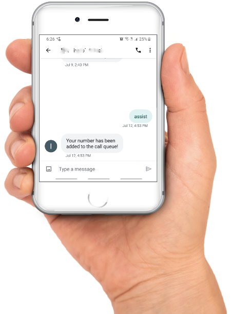

## Amazon Pinpoint Connect Callback Requestor
Use Amazon Web Services (AWS) Pinpoint, Lambda and Connect to transparently put customers into a phone callback queue upon an SMS request from them.

One of the most frustrating experiences of using live customer service is having wait on the line for an agent to become available, listening to pre-recorded messages and music for a long period of time. With this approach, your users can instead simply ask for an agent to call them and the system will automatically initiate the call once the next agent becomes available.

Major benefits:
1. Customer does not wait on the line (nor consumes the line)
2. Customer is put immediately into the queue (following the standard FIFO)
3. Customer gets immediate confirmation that they have been put into the queue
4. All of the flows are asynchronous/independent of each other
5. Limited only by the configured Callback queue (no intrinsic volume limit)
6. Provides for full native visibility (including wait-times)

Note, this same logic/code can be reused for other similar flows, like a button on your website or your mobile app.

## License Summary
This sample code and flow is made available under Open Source - MIT No Attribution License (MIT-0). See the [LICENSE](/LICENSE) file.

### Architecture
The flow itself is very simple - user sends SMS with a predefined keyword (e.g. "assist"), gets a response confirming that they have been put into the queue, and later on gets the call, once the contact center agent does become available. 
On the implementation side, upon an SMS request from the user, AWS Pinpoint publishes to AWS SNS queue. A custom AWS Lambda function gets triggered on this new event, confirms configured keyword was part of the request,ß and commands AWS Connect to issue a Call-out to another AWS Connect number (behind the scenes, aka fake) and a custom AWS Connect Flow at that point configures the proper Callback queue and the Callback phone number of the user to use. As all of this occurs behind the scenes, user remains unaware of the details and does not have to remain on the line (nor listen to the music) - they receive a call once the next available Agent is already on the line.


### Prerequisites
This flow requires that you have an AWS Account with AWS Pinpoint project and AWS Connect instance set up. 
No extra configuration is required - you can start right out of the gate.

### Repository content
Main files:
```bash
.
├── README.MD                   <-- This instructions file
├── ExecutionRole.json          <-- Sample IAM policy (also part of the SAM template). Make sure to edit manually first!
├── src                         <-- Source code for a lambda function
│   └── app.js                  <-- Lambda function code
│   └── connectFlow.json        <-- Connect flow export flow for programmatic callback. Make sure to edit manually first!
│   └── package.json            <-- NodeJS dependencies and scripts
│   └── tests                   <-- Unit tests
│       └── unit
│           └── eventData.json  <-- Sample payload that mimics the SMS received from customer (from Pinpoint via SNS). Make sure to edit manually first!
├── template.yaml               <-- SAM template. Make sure to edit manually first!
```

### Setup
#### Step 1: Pinpoint
Create the new Pinpoint project and request a new long-code (the phone number through which all of the interactions will take place). See [steps 1.1 and 1.2 of this tutorial](https://docs.aws.amazon.com/pinpoint/latest/developerguide/tutorials-two-way-sms-part-1.html). Alternatively, you can simply reuse an existing project and phone number (aka long- or short-code).  
Enable two-way SMS by clicking on the long-code of choice under the "SMS and voice" Settings and enabling the 2-way with the SNS topic defined. See [step 1.3 of the same tutorial](https://docs.aws.amazon.com/pinpoint/latest/developerguide/tutorials-two-way-sms-part-1.html). Take note of this SNS topic (new or existing).    
If this number will be used for outgoing notifications, make sure you handle unsubscribe (aka STOP) requests.  
Optionally add a temporary email subscription to the SNS topic to passively and proactively monitor it during debugging.  
Send SMS through and confirm SNS event occurs.
#### Step 2: Connect
Create the new Connect instance or identify the one you want to reuse along with the phone number(s). 
Optionally setup new basic Connect queue for Callback and another one for Callback routing if you want to use a separate number for that.  
Create new flow to push new callback requests. Feel free to use [src/connectFlow.json](src/connectFlow.json) as a reference (but take note to replace the Account ID, Region, etc. to the appropriate ones from your own account). The general flow should look along the lines of the following:  

Note the main portions of the flow above is:
1. The _Set callback number_ set to "callbacknumber" attribute (no quotes):  

2. And following it _Transfer to queue_ set to _Transfer to callback queue_ with the appropriate queue selected:  

#### Step 3: Permissions/IAM
Add new Lambda execution role with limited permissions to Pinpoint (to respond to the customer), Connect (to actually place customer's phone number into the queue), and CloudWatch Logs (for basic logging and debugging). 
Feel free to either reuse [ExecutionRole.json](ExecutionRole.json) provided or copy YAML portion from [template.yaml](template.yaml) if you prefer.  
Remember that AWS Policies are always designed to only allow what is absolutely necessary. As you expand your application, you may need to add new (or remove) resources and functions you intend to call. You may also want to add X-Ray permissions down the line for full tracing support.
#### Step 4: Lambda
Add the new Lambda function (either upload the included Lambda directly or copy-paste).  
Set Environment variables - these are dynamic configuration parameters that you will be able to switch/change in production.  
  
* ConnectContactFlowId, ConnectInstanceId, ConnectQueueId are the Flow ID, Instance and Queue IDs specific to your Connect instance.
* PinpointApplicationId is your Pinpoint Project ID.
* Keyword is the filter keyword you want the customers to send via SMS to trigger the flow. Alternatively you can filter via SNS subscription setting itself (loose visibility but minimize costs).
* FakeNumber is the number you want to be dialed for the handover. You can use your main Connect line or setup an independent temporary number that does not do any actual agent hand-over.  

Associate Lambda with SNS.  
Save.  
Configure a new Lambda Test event - use included eventData.json for the sample payload, but remember to change the phone number.

#### Step 5: Run and Confirm
Run test and confirm your event produces the SMS back to the number you specified or check console for errors.  
Send a manual SMS to your Pinpoint number and confirm your event goes through SNS and you receive another response via SMS.  
Go to Connect, Analytics, Real-Time, Queues and confirm the callback queue numbers increased based on your requests (there should be at least 2 now, 1 from the Lambda test, 1 from the last SMS one). Note that the number may take a short while (several minutes) to update, depending on your setup.
